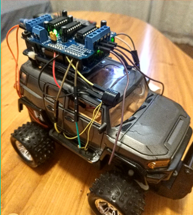

# Car Hacking

Projeto **Arduino** para controlar um carrinho.

### Componentes utilizados:
- Arduino Uno
- Motor Shield L293D
- Módulo Bluetooth HC-06
- Buzzer Ativo 5V
- Sensor Ultrassônico HC-SR04 

#### Imagens

| Carrinho v2                | Entendimento Motores                | 
|----------------------------------|----------------------------------| 
|  |  | 

## Finalidade

- [x] **Estudo**: Este projeto foi criado para fins de aprendizado e prática.
- [ ] **Curso**: Este projeto é parte de um curso específico.
- [ ] **Projeto Real**: Este projeto é uma aplicação real a ser publicado.

Com o estudo o foco foi controlar um carrinho de controle remoto incorporando o arduino e substituindo o controle padrão pelo **Arduino**.

Com o arduino foi possível controlar os LEds que o carrinho já possuia, assim como os motores existentes. Adicionando um buzzer como buzina, e sensor para que o carrinho não batesse de proposito.  
Controlado por aplicativo bluetooth. *Vide abaixo.*

##### Command Mapping

| Command         | Char |
|-----------------|------|
| BTN_LED_ON      | 'a'  |
| BTN_LED_OFF     | 'b'  |
| BTN_BUZZ        | 'c'  |
| AXIS_UP         | 'd'  |
| AXIS_DOWN       | 'e'  |
| AXIS_LEFT_UP    | 'f'  |
| AXIS_LEFT_DOWN  | 'g'  |
| AXIS_RIGHT_UP   | 'h'  |
| AXIS_RIGHT_DOWN | 'i'  |
| AXIS_CENTERED   | 'j'  |

## Outras Considerações

- **Construção paralizada:** Emeados de 2019;
- App de controle bluetooth pode ser encontrado nesse repositório: [Android Joystick Bluetooth for Arduino](https://github.com/fbvictorhugo/joystick_bluetooth?tab=readme-ov-file#android-joystick-bluetooth-for-arduino-)